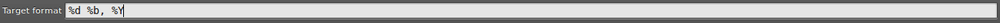

QuickDatesFormatter
===================

Plugin for SublimeText3

(Some ideas borrowed from PJ Dietz's [sublime-date-formatter]( https://github.com/pjdietz/sublime-date-formatter/blob/master/README.md))

## Installation

### Git Installation

To install manually, clone to your "Packages" directory.

```git clone https://github.com/lalstef/QuickDatesFormatter.git "QuickDatesFormatter"```

## Usage

1. Activate the Command Palette and select the `QuickDatesFormatter: Format dates` command.
2. Select a format from the dropdown list to match all dates within the current open file (view)
3. Type the format (python style) to which you want the selected dates formatted. (Default format is suggested (according to "target_format" settings)


